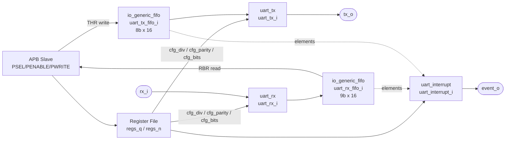

# APB UART (`apb_uart_sv`) — Architecture

This document describes the architecture of the `apb_uart_sv` core: an APB‑mapped,
16550‑style UART. The instance hierarchy was extracted from the elaborated design
and the register map was derived from the RTL in [src/apb_uart_sv.sv](../src/apb_uart_sv.sv).

## 1. Overview

`apb_uart_sv` is a full‑duplex UART with:

- An **APB slave** interface for register access (4 KB address space by default).
- A **transmit** datapath: APB write → TX FIFO → serializer (`uart_tx`) → `tx_o`.
- A **receive** datapath: `rx_i` → deserializer (`uart_rx`) → RX FIFO → APB read.
- A **16550‑compatible register file** with Divisor Latch (DLAB) access.
- An **interrupt controller** (`uart_interrupt`) driving a single `event_o` line.

Default configuration parameters:

| Parameter         | Default | Description                              |
| ----------------- | ------- | ---------------------------------------- |
| `APB_ADDR_WIDTH`  | `12`    | APB address width (4 KB slave).          |
| `TX_FIFO_DEPTH`   | `16`    | Transmit FIFO depth (bytes).             |
| `RX_FIFO_DEPTH`   | `16`    | Receive FIFO depth (bytes, +parity bit). |

## 2. Top‑Level Interface

| Signal     | Dir | Width              | Description                              |
| ---------- | --- | ------------------ | ---------------------------------------- |
| `CLK`      | in  | 1                  | System clock.                            |
| `RSTN`     | in  | 1                  | Active‑low asynchronous reset.           |
| `PADDR`    | in  | `APB_ADDR_WIDTH`   | APB address (only `PADDR[2:0]` decoded). |
| `PWDATA`   | in  | 32                 | APB write data.                          |
| `PWRITE`   | in  | 1                  | APB write (1) / read (0).                |
| `PSEL`     | in  | 1                  | APB select.                              |
| `PENABLE`  | in  | 1                  | APB enable (access phase).               |
| `PRDATA`   | out | 32                 | APB read data.                           |
| `PREADY`   | out | 1                  | APB ready (tied high — zero wait state). |
| `PSLVERR`  | out | 1                  | APB slave error (tied low — never errs). |
| `rx_i`     | in  | 1                  | Serial receive input.                    |
| `tx_o`     | out | 1                  | Serial transmit output.                  |
| `event_o`  | out | 1                  | Interrupt / event output.                |

## 3. Instance Hierarchy

The elaborated module hierarchy rooted at `apb_uart_sv`:

```
apb_uart_sv                         (src/apb_uart_sv.sv)
├── uart_rx_i          : uart_rx            — serial receiver / deserializer
├── uart_tx_i          : uart_tx            — serial transmitter / serializer
├── uart_rx_fifo_i     : io_generic_fifo    — RX FIFO (DATA_WIDTH=9, DEPTH=16)
├── uart_tx_fifo_i     : io_generic_fifo    — TX FIFO (DATA_WIDTH=8, DEPTH=16)
└── uart_interrupt_i   : uart_interrupt     — interrupt controller
    (plus the register file: combinational read/write decode + sequential register bank)
```



### 3.1 Sub‑module summary

#### `uart_rx` (instance `uart_rx_i`)

Serial receiver with a 6‑state FSM (`IDLE`, `START_BIT`, `DATA`, `SAVE_DATA`,
`PARITY`, `STOP_BIT`). Samples `rx_i`, recovers the byte using the configured
baud divisor, optional parity, and configurable data‑bit count.

| Port              | Dir | Width | Source connection                         |
| ----------------- | --- | ----- | ----------------------------------------- |
| `clk_i`           | in  | 1     | `CLK`                                      |
| `rstn_i`          | in  | 1     | `RSTN`                                     |
| `rx_i`            | in  | 1     | `rx_i`                                     |
| `cfg_en_i`        | in  | 1     | `1'b1` (always enabled)                    |
| `cfg_div_i`       | in  | 16    | `{DLM, DLL}` divisor latch                 |
| `cfg_parity_en_i` | in  | 1     | `LCR[3]`                                   |
| `cfg_bits_i`      | in  | 2     | `LCR[1:0]`                                 |
| `busy_o`          | out | 1     | unconnected                               |
| `err_o`           | out | 1     | `parity_error`                            |
| `err_clr_i`       | in  | 1     | `1'b1`                                     |
| `rx_data_o`       | out | 8     | `rx_data` → RX FIFO                        |
| `rx_valid_o`      | out | 1     | `rx_valid` → RX FIFO                       |
| `rx_ready_i`      | in  | 1     | `rx_ready` from RX FIFO                    |

#### `uart_tx` (instance `uart_tx_i`)

Serial transmitter with a 6‑state FSM (`IDLE`, `START_BIT`, `DATA`, `PARITY`,
`STOP_BIT_FIRST`, `STOP_BIT_LAST`). Serializes bytes popped from the TX FIFO with
the configured baud divisor, parity, data bits and stop bits.

| Port              | Dir | Width | Source connection          |
| ----------------- | --- | ----- | -------------------------- |
| `clk_i`           | in  | 1     | `CLK`                       |
| `rstn_i`          | in  | 1     | `RSTN`                      |
| `tx_o`            | out | 1     | `tx_o`                      |
| `busy_o`          | out | 1     | unconnected                |
| `cfg_en_i`        | in  | 1     | `1'b1` (always enabled)     |
| `cfg_div_i`       | in  | 16    | `{DLM, DLL}` divisor latch  |
| `cfg_parity_en_i` | in  | 1     | `LCR[3]`                    |
| `cfg_bits_i`      | in  | 2     | `LCR[1:0]`                  |
| `cfg_stop_bits_i` | in  | 1     | `LCR[2]`                    |
| `tx_data_i`       | in  | 8     | `tx_data` from TX FIFO      |
| `tx_valid_i`      | in  | 1     | `tx_valid` from TX FIFO     |
| `tx_ready_o`      | out | 1     | `tx_ready` → TX FIFO        |

#### `io_generic_fifo` (instances `uart_rx_fifo_i`, `uart_tx_fifo_i`)

Parameterizable synchronous FIFO used for both directions.

- `uart_rx_fifo_i`: `DATA_WIDTH = 9` (8 data bits + parity flag), `BUFFER_DEPTH = 16`.
- `uart_tx_fifo_i`: `DATA_WIDTH = 8`, `BUFFER_DEPTH = 16`.

Exposes `elements_o` (fill level, used by the interrupt controller), a
valid/ready producer port and a valid/ready consumer port, plus a synchronous
`clr_i` for FIFO flush (driven by the FCR fifo‑clear bits).

#### `uart_interrupt` (instance `uart_interrupt_i`)

Generates `event_o` and the 4‑bit `IIR_o` identification code. Parameterized by
`TX_FIFO_DEPTH`/`RX_FIFO_DEPTH` (both `16`). Implements the receiver‑trigger‑level
comparison against the RX FIFO fill level:

| `trigger_level_i` (FCR[7:6]) | RX FIFO elements for trigger |
| ---------------------------- | ---------------------------- |
| `2'b00`                      | 1                            |
| `2'b01`                      | 4                            |
| `2'b10`                      | 8                            |
| `2'b11`                      | 14                           |

Inputs include `IER_i` (`IER[2:0]`), `RDA_i` (`LSR[5]`), `error_i` (`LSR[2]`),
`rx_elements_i`, `tx_elements_i`, `trigger_level_i`, and the one‑hot `clr_int_i`
interrupt‑clear vector produced by register reads.

## 4. Register Map

Registers are selected by `register_adr = PADDR[2:0]` (8 addresses). The map is
16550‑compatible: several addresses are overloaded by access direction
(read/write) and by the **DLAB** bit (`LCR[7]`, Divisor Latch Access Bit).

Internally the register bank is `regs_q[9:0][7:0]` (10 bytes). The RBR/THR address
is not a stored register — it maps directly onto the RX/TX FIFOs — while the two
divisor‑latch bytes are stored at internal indices `8` (DLL) and `9` (DLM).

| Addr (`PADDR[2:0]`) | DLAB | Access | Name | Reset | Description                              |
| ------------------- | ---- | ------ | ---- | ----- | ---------------------------------------- |
| `0x0`               | 0    | R      | RBR  | —     | Receiver Buffer Register (pop RX FIFO).  |
| `0x0`               | 0    | W      | THR  | —     | Transmit Holding Register (push TX FIFO).|
| `0x0`               | 1    | R/W    | DLL  | `0x00`| Divisor Latch (Low byte).                |
| `0x1`               | 0    | R/W    | IER  | `0x00`| Interrupt Enable Register.               |
| `0x1`               | 1    | R/W    | DLM  | `0x00`| Divisor Latch (High byte).               |
| `0x2`               | —    | R      | IIR  | `0x01`| Interrupt Identification Register (RO).   |
| `0x2`               | —    | W      | FCR  | —     | FIFO Control Register (WO).               |
| `0x3`               | —    | R/W    | LCR  | `0x00`| Line Control Register.                    |
| `0x4`               | —    | R/W    | MCR  | `0x00`| Modem Control Register (stored, unused).  |
| `0x5`               | —    | R      | LSR  | `0x60`| Line Status Register.                     |
| `0x6`               | —    | R      | MSR  | `0x00`| Modem Status Register (stored, unused).   |
| `0x7`               | —    | R/W    | SCR  | `0x00`| Scratch Register.                         |

> DLAB (`LCR[7]`) selects the divisor latch at addresses `0x0`/`0x1`:
> when set, `0x0`→DLL and `0x1`→DLM; when clear, `0x0`→RBR/THR and `0x1`→IER.

### 4.1 Bit‑level detail of implemented registers

#### THR / RBR (addr `0x0`, DLAB = 0)

- **Write (THR):** `PWDATA[7:0]` is pushed into the TX FIFO (`fifo_tx_valid`).
- **Read (RBR):** returns `fifo_rx_data[7:0]` (pops the RX FIFO) and clears the
  *Received Data Available* interrupt (`clr_int = 4'b1000`).

#### DLL / DLM (addr `0x0` / `0x1`, DLAB = 1)

- 16‑bit baud divisor `{DLM, DLL}` driven to `cfg_div_i` of both `uart_rx` and
  `uart_tx`. Reset `0x0000`.

#### IER — Interrupt Enable Register (addr `0x1`, DLAB = 0), reset `0x00`

Only the low 3 bits are used (`IER[2:0]` → `uart_interrupt`):

| Bit | Function (per 16550)                 |
| --- | ------------------------------------ |
| 0   | Received Data Available interrupt en |
| 1   | Transmitter Holding Register Empty en|
| 2   | Receiver Line Status interrupt en    |

#### IIR — Interrupt Identification Register (addr `0x2`, read‑only), reset `0x01`

Read value = `{2'b11, 2'b00, IIR_o[3:0]}`; i.e. bits `[7:6] = 11` (FIFOs
enabled), bits `[5:4] = 00`, bits `[3:0] = IIR_o` from `uart_interrupt`.
Reading IIR clears the *THR‑empty* interrupt (`clr_int = 4'b0100`).

#### FCR — FIFO Control Register (addr `0x2`, write‑only)

| Bit   | Function                                              |
| ----- | ----------------------------------------------------- |
| 1     | RX FIFO clear (self‑clearing pulse `rx_fifo_clr_n`).  |
| 2     | TX FIFO clear (self‑clearing pulse `tx_fifo_clr_n`).  |
| 7:6   | RX interrupt trigger level (`trigger_level_n`).       |

#### LCR — Line Control Register (addr `0x3`, R/W), reset `0x00`

| Bit   | Function                                              |
| ----- | ----------------------------------------------------- |
| 1:0   | Word length select → `cfg_bits_i` (5–8 data bits).    |
| 2     | Stop bits → `cfg_stop_bits_i` (TX only).              |
| 3     | Parity enable → `cfg_parity_en_i`.                    |
| 7     | DLAB — Divisor Latch Access Bit.                      |

#### LSR — Line Status Register (addr `0x5`, read), reset `0x60`

| Bit | Function                                                      |
| --- | ------------------------------------------------------------ |
| 0   | Data Ready — RX FIFO has data (`fifo_rx_valid`).             |
| 2   | Parity Error of the retrieved RX element (`fifo_rx_data[8]`).|
| 5   | THR Empty — TX FIFO empty (`~|tx_elements`).                 |
| 6   | Transmitter Empty — TX FIFO and shifter empty.              |

Reset value `0x60` sets bits 5 and 6 (transmitter empty at reset). Reading LSR
clears the parity/line‑status interrupt (`clr_int = 4'b1100`).

#### MCR, MSR, SCR

- **MCR** (`0x4`) and **MSR** (`0x6`) are implemented as storage only (reset
  `0x00`); modem control/status handshake lines are not wired out of this core.
- **SCR** (`0x7`) is a general‑purpose scratch register (reset `0x00`).

### 4.2 Reset state summary

| Register | Reset value |
| -------- | ----------- |
| IER      | `0x00`      |
| IIR      | `0x01`      |
| LCR      | `0x00`      |
| MCR      | `0x00`      |
| LSR      | `0x60`      |
| MSR      | `0x00`      |
| SCR      | `0x00`      |
| DLL      | `0x00`      |
| DLM      | `0x00`      |

## 5. APB Access Behaviour

- `PREADY` is tied high and `PSLVERR` tied low: every access completes in the
  APB access phase with zero wait states and never signals an error.
- Writes commit on `PSEL & PENABLE & PWRITE`; reads drive `PRDATA` on
  `PSEL & PENABLE & !PWRITE`. Register reads additionally emit one‑hot
  `clr_int` pulses to acknowledge interrupts.
